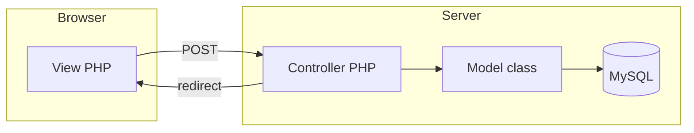
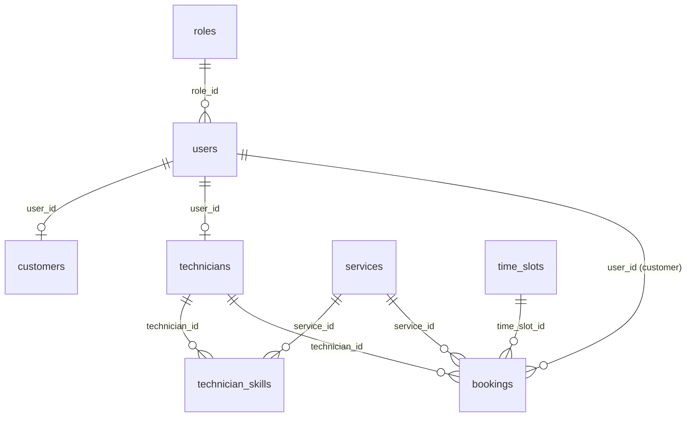

# JEL-IMS — Technical System Guide

**JEL Air Conditioning Service Management System** — PHP (OOP + procedural controllers), MySQL (PDO), HTML/CSS/JS.

This document explains how the project is structured, how data flows, and where important rules live in code. Use it as a map; for **line-by-line** explanations, pick a single file and walk through it with a mentor (or ask the AI to focus on that file only).

**Schema source of truth:** `jel_ims/database/jel_ims.sql` (nested folder under the project; a copy may also appear elsewhere). Adjust the path if your checkout layout differs.

---

## 1. System overview

### 1.1 Architecture: MVC-style, not “classic” MVC

The codebase **separates** concerns like MVC:

| Layer | Location | Role |
|--------|-----------|------|
| **Models** | `app/models/*.php` | Database access (PDO), entity-oriented classes (`User`, `Booking`, …). |
| **Views** | `app/views/**/*.php` | PHP templates that output HTML; include `layouts/header.php`, `sidebar.php`, `footer.php`. |
| **Controllers** | `app/controllers/*.php` | Scripts invoked directly by forms or as endpoints: `session_start()`, validate input, call models, `header('Location: …')` redirect. |

What it is **not**: there is **no single front controller** that routes every URL. `public/index.php` is currently a **placeholder** only. Real usage is:

```text
Browser → direct URL to a view (e.g. login.php)
       → form POST → app/controllers/SomeController.php
       → redirect → view again
```

So the pattern is **“page-centric PHP + controller scripts as POST endpoints.”**

### 1.2 File structure (mental map)

```text
jel_ims/   (project root — name may vary)
├── app/
│   ├── config/Database.php      # PDO connection (host, db name, credentials)
│   ├── controllers/             # Auth, User, Booking, Technician, Report, Notification
│   ├── models/                  # User, Role, Customer, Technician, Booking, Service, TimeSlot, Notification
│   └── views/
│       ├── auth/                # login, register
│       ├── admin/, staff/, technician/, customer/
│       └── layouts/             # header (CSS + $jel_ims_web_root), sidebar (nav by role), footer
├── jel_ims/database/            # jel_ims.sql + sample SQL (in this repo layout)
├── public/
│   ├── css/style.css
│   ├── index.php                # placeholder
│   └── logout.php               # destroys session, redirects to login
```

**Base URL:** `header.php` / `sidebar.php` compute `$jel_ims_web_root` from `$_SERVER['SCRIPT_NAME']` so links work when the app lives in a subdirectory (e.g. `/jel_ims`).

### 1.3 Core modules

| Module | Main pieces |
|--------|-------------|
| **Authentication** | `AuthController.php`, `views/auth/*`, `User.php`, `Role.php` |
| **User & role admin** | `UserController.php`, `views/admin/manage_users.php`, `User.php` |
| **Technicians & skills** | `Technician.php`, technician creation inside `UserController.php`, `technician_skills` table |
| **Bookings** | `Booking.php`, `BookingController.php`, customer/staff/admin views |
| **Assignment** | `Booking::autoAssignTechnician`, manual assign in `TechnicianController.php`, `assign_technicians.php` |
| **Notifications** | `Notification.php`, `NotificationController.php`, `notifications` table |
| **Reporting / RFM** | `ReportController.php`, admin report views, SQL view `rfm_customer_analysis` |
| **Customer profile** | `Customer.php`, registration creates `users` + `customers` |

### 1.4 High-level request flow



---

## 2. Database understanding

### 2.1 Roles (`roles`)

- **Columns:** `id`, `role_name`.
- **Seeded values (fixed IDs in app code):**
  - `1` — Admin  
  - `2` — Staff  
  - `3` — Technician  
  - `4` — Customer  

`users.role_id` is a **foreign key** to `roles.id` (`ON DELETE RESTRICT`).

**How roles are handled in the app**

- Stored in **database**, not hard-coded strings on the user row (except redirects that use numeric IDs).
- `AuthController` redirects after login using **`role_id`** with a `switch` (1→admin dashboard, 2→staff, 3→technician, 4→customer).
- `sidebar.php` shows navigation based on `$_SESSION['role_id']`.
- Controllers re-check `role_id` for sensitive actions (e.g. `UserController` allows Admin/Staff session access but constrains Staff to technician-focused actions; `BookingController` requires Customer for create; `TechnicianController` restricts manual assign to Staff).

### 2.2 Users (`users`) — focus table

| Column | Purpose |
|--------|---------|
| `id` | Primary key |
| `full_name`, `email` | Identity; `email` unique |
| `password` | Intended: bcrypt hash (`password_hash` in PHP) |
| `role_id` | FK → `roles` |
| `status` | **Soft lifecycle:** `'Active'` \| `'Inactive'` (app uses exact strings in many places) |
| `created_at` | Audit |

**Relationships**

- **One** `customers` row can reference a user (`customers.user_id` → `users.id`, CASCADE delete).
- **One** `technicians` row can reference a user (`technicians.user_id` → `users.id`, CASCADE delete).
- **Many** `bookings` per user as customer (`bookings.user_id` → `users.id`).

### 2.3 Technicians (`technicians`) — focus table

| Column | Purpose |
|--------|---------|
| `id` | Primary key (this is `bookings.technician_id`) |
| `user_id` | Links to login account (role should be Technician, `role_id = 3`) |
| `availability_status` | e.g. `'Available'` (used in `getAvailableTechnicians`) |

**Important:** A “technician” in the **business** sense is **`users` + `technicians`** — login and name live on `users`; operational id for assignments is `technicians.id`.

### 2.4 Technician skills (`technician_skills`) — focus table

Many-to-many between **technician** and **service** (skill = able to perform that service).

| Column | Purpose |
|--------|---------|
| `technician_id` | FK → `technicians.id` (CASCADE) |
| `service_id` | FK → `services.id` |

**Uniqueness:** The schema does **not** show a `UNIQUE (technician_id, service_id)` constraint; the app deduplicates skill IDs in PHP when creating a technician.

### 2.5 Bookings (`bookings`) — focus table

| Column | Purpose |
|--------|---------|
| `user_id` | Customer (owner of booking) |
| `technician_id` | Nullable; set when assigned |
| `service_id`, `booking_date`, `time_slot_id` | What/when |
| `status` | Workflow: `Unassigned`, `Assigned`, `Ongoing`, `Completed`, `Cancelled`, `No-Show` (app conventions) |
| `cancellation_reason`, `rescheduled_from_booking_id` | Optional workflow fields |
| `created_by`, `updated_by`, `updated_at` | Audit |

**Constraints / indexes**

- `UNIQUE (technician_id, booking_date, time_slot_id)` — **one booking per technician per date+slot** (MySQL allows multiple `NULL` `technician_id`, so many unassigned rows can share the same slot).

**Relationships**

- `user_id` → `users.id` (RESTRICT delete).
- `technician_id` → `technicians.id` (SET NULL on delete).
- `service_id` → `services.id`, `time_slot_id` → `time_slots.id`.

### 2.6 Other tables (short)

| Table | Role |
|-------|------|
| `services` | Catalog; duration used in RFM view |
| `time_slots` | Discrete slots (e.g. 8:00 AM) |
| `service_history` | Notes / completion per booking |
| `notifications` | Per-user messages, optional `booking_id` |
| `notification_triggers` | Reference / seed labels |
| **View** `rfm_customer_analysis` | Aggregates **Completed** bookings per customer |

---

## 3. User management flow

### 3.1 How users are created

**A) Self-registration (Customer only)** — `AuthController.php` (`$_POST['register']`):

1. Validates name, email, password (non-empty).
2. Loads Customer role id from DB via `Role::getAllRoles()` (name = `'Customer'`).
3. `User::createUser(...)` → bcrypt password, `status = 'Active'`.
4. `Customer::createCustomer` for profile; on failure, `User::deleteUser` rollback.

**B) Admin creates Admin or Staff** — `UserController.php`, action `create_user`:

- In the current workflow, direct account creation from this action is intentionally disabled.
- Admin still handles governance/oversight, while operations are handled in Staff pages.

**C) Staff creates Technician** — `UserController.php`, action `create_technician`:

- Single **transaction**: insert `users` (role 3), insert `technicians`, insert **≥ 1** `technician_skills` rows.
- Uses `createUserOnConnection`, `createTechnicianOnConnection`, `insertTechnicianSkillsOnConnection`.

### 3.2 How roles affect behavior

- **Login redirect** maps `role_id` → default dashboard (`AuthController`).
- **Navigation** is role-gated in `sidebar.php`.
- **Server-side** each controller checks `$_SESSION['role_id']` for the operation (never rely on hiding UI only).

### 3.3 Soft delete (`users.status`)

- **Values:** Application expects **`Active`** and **`Inactive`** (case-sensitive in `User::setUserStatus`).
- **Login:** `AuthController` rejects login if `status` is not `Active` (case-insensitive compare).
- **Admin “set status”** — `UserController`, action `set_status`:
  - Cannot deactivate **yourself**.
  - Cannot deactivate the **last Active Admin**.
  - Cannot deactivate a technician who has **busy** bookings (`Assigned` or `Ongoing`) — `Booking::countTechnicianBusyBookings`.
- **No row deletion** for normal disable; `DELETE FROM users` exists in `User` model but is used for registration rollback, not as the main “delete user” UX.

---

## 4. Technician system

### 4.1 How a technician is created (`users` + `technicians`)

1. Insert **`users`**: `role_id = 3` (Technician), `status = Active`, hashed password.
2. Insert **`technicians`**: `user_id` from step 1, `availability_status` default `'Available'`.
3. Insert **`technician_skills`**: at least one valid `service_id` from catalog.

All three steps are wrapped in a **PDO transaction** in `UserController::jel_ims_uc_handle_create_technician_user`.

### 4.2 How skills are stored and used

- **Storage:** one row per (technician, service) in `technician_skills`.
- **Use in auto-assignment:** `Technician::getTechniciansByService($service_id)` returns technicians who have a skill row for that service. `Booking::autoAssignTechnician` starts from this list.

### 4.3 How technician filtering works

| Method | Filter |
|--------|--------|
| `getAllTechnicians()` | All technician rows + user name/email (**no** skill filter, **no** “Active user” filter in SQL). |
| `getAvailableTechnicians()` | `availability_status = 'Available'`. |
| `getTechniciansByService($service_id)` | Joins `technician_skills` for that service. |

**Staff assign UI** (`staff/assign_technicians.php`) loads **`getAllTechnicians()`** for the dropdown — so the list is **not** limited by skill or slot until the controller checks conflicts.  
**Admin assign page** remains available as read-only oversight.

---

## 5. Booking + assignment flow

### 5.1 How bookings are created

**Customer** — `BookingController.php` when `$_POST['create_booking']`:

1. Requires session and **`role_id === 4`**.
2. Validates service, slot, date (`Y-m-d`), not in the past.
3. `Booking::userHasBookingForSlot` — blocks duplicate same user/date/slot unless status is `Cancelled` or `No-Show`.
4. `Booking::createBooking` with `technician_id = null`, **`status = 'Unassigned'`**, sets `created_by` to customer.
5. Notifications: customer, all admins (role 1).
6. **`Booking::autoAssignTechnician`** runs immediately after insert.
7. If a technician was assigned, more notifications (customer + technician user).

### 5.2 How technicians are assigned

**Automatic**

- `Booking::autoAssignTechnician`:
  - Loads booking; skips if terminal status or already has technician.
  - Gets skilled technicians for `service_id`.
  - Drops anyone with **slot conflict** (`technicianHasSlotConflict`).
  - Ranks by **workload** (count of `Assigned` + `Ongoing`), tie-break by lower `technicians.id`.
  - Calls `assignTechnician` inside a transaction.

**Manual (Staff)**

- `TechnicianController.php` when `$_POST['assign_technician']`:
  - **Staff only** (`role_id === 2`).
  - Booking must be **`Unassigned`** and have no technician.
  - **`isTechnicianSlotTaken`** must be false (double-booking guard).
  - **`assignTechnician`** sets `Assigned` and audit fields.

### 5.3 How skills affect assignment

- **Auto:** only technicians with a matching **`technician_skills`** row for the booking’s `service_id` are candidates.
- **Manual:** the controller does **not** re-check skill match — only slot and state. The UI lists all technicians from `getAllTechnicians()`.

**Status updates (technician/admin):** `TechnicianController` allows `Assigned` → `Ongoing` / `Completed` / `No-Show`, and `Ongoing` → `Completed` / `No-Show`, with technicians restricted to **their** `technician_id`. `No-Show` increments `customers.no_show_count`.

---

## 6. Authentication system

### 6.1 Login flow

1. `login.php` POSTs to `AuthController.php` with `login` field.
2. Load user by email; fail if missing.
3. Reject if `status` is not active (inactive soft-delete).
4. **`password_verify`** against stored hash.
5. **Legacy plain-text compatibility:** if password is not bcrypt and equals stored string, `updateUser` re-hashes (for old seeds).
6. **`session_regenerate_id(true)`** then set `$_SESSION['user_id']`, `$_SESSION['role_id']`.
7. Redirect by `role_id`.

### 6.2 Password hashing

- **`User::createUser` / `updateUser`** use `password_hash($plain, PASSWORD_DEFAULT)` (bcrypt family).
- **Seed SQL** in `jel_ims.sql` inserts default admin with **literal** `admin123` — fine for class demos; production must use hashed passwords or rely on first-login upgrade path.

### 6.3 Session handling

- Controllers call `session_start()` at the top.
- **`public/logout.php`** clears `$_SESSION`, expires session cookie, `session_destroy()`, redirects to login.

### 6.4 Role-based access control (RBAC)

- **Coarse:** numeric `role_id` in session + checks per action.
- **Not present:** a centralized middleware/router; each controller duplicates patterns like `jel_ims_*_require_*`.

---

## 7. Business rules (implemented vs gaps)

### 7.1 Implemented rules (examples)

- Last **Active** admin protected when changing role or setting **Inactive**.
- Admin cannot set **Inactive** on self.
- Technician with **Assigned/Ongoing** bookings cannot be set **Inactive**.
- Customer cannot double-book same date+slot (excluding cancelled/no-show).
- Manual assign: only **Unassigned** bookings; slot conflict check.
- Auto assign: skill + workload + slot conflict.
- Cancellation allowed only for certain statuses (`Booking::cancelBooking`).

### 7.2 Missing or weak validations (good improvement targets)

| Area | Observation |
|------|----------------|
| **Manual assign** | No check that technician has **skill** for booking’s service. |
| **Auto assign / skilled list** | SQL does not filter `users.status = 'Active'` — inactive accounts could still be candidates if rows remain. |
| **Assign UI** | Uses all technicians, not “available” or “skilled for this service”. |
| **Registration** | Weaker password rules than admin-created users (no min length in controller path). |
| **Staff role** | Operational role is now implemented (manage technicians, assignment, booking/customer operational views). |
| **CSRF** | `UserController` comment notes no tokens; same pattern elsewhere — forms are vulnerable to cross-site POST in production. |
| **Central RBAC** | Magic numbers for role IDs scattered; a single config or `Role` lookup would reduce drift. |

### 7.3 Suggested improvements (pragmatic, not over-engineered)

1. **Manual assign:** before `assignTechnician`, verify `technician_skills` exists for (`technician_id`, booking `service_id`), or filter dropdown in the view with `getTechniciansByService`.
2. **Auto assign / queries:** add `AND u.status = 'Active'` (and optionally `availability_status = 'Available'`) to skilled-technician queries.
3. **Password policy:** reuse the same min-length/confirm rules on register as on admin create.
4. **Config:** define `ROLE_ADMIN = 1`, … in one `config/roles.php` and require it everywhere.
5. **Front controller (optional):** one `public/index.php` that routes `?r=login` etc., to hide `app/` from the web root — improves security if the server document root is tightened later.

---

## 8. Code walkthrough (how to use this section)

This guide is **not** a full line-by-line dump of every file. For mentoring:

1. Open **one** file (e.g. `app/controllers/UserController.php`).
2. Read top-to-bottom: **requires**, **session guards**, **which `$_POST` keys** dispatch work, **which model methods** run, **redirect URLs**.
3. Jump to the **model** for SQL shape.

**Suggested “key files” order for learners**

1. `app/config/Database.php` — connection
2. `app/models/User.php` — hashing, soft status
3. `app/controllers/AuthController.php` — login/register
4. `app/controllers/UserController.php` — admin user lifecycle
5. `app/models/Booking.php` — `autoAssignTechnician`, cancellation
6. `app/controllers/BookingController.php` — customer create + cancel
7. `app/controllers/TechnicianController.php` — manual assign + status transitions
8. `app/views/layouts/sidebar.php` — what each role *sees*

Ask for a **specific file** when you want a line-by-line pass; that stays readable and accurate.

---

## 9. Best practices — honest review

### 9.1 What works well for a learning / small project

- Clear **folder split** (models / views / controllers).
- **Prepared statements** in models.
- **Transactions** for technician creation.
- **Session regeneration** on login.
- **Business guards** (last admin, busy technician) in one controller.

### 9.2 Practices to improve for production

| Topic | Issue |
|--------|--------|
| **Routing / public exposure** | `app/` is reachable if the server maps the whole project; ideal doc root is `public/` only. |
| **Secrets** | DB credentials in `Database.php` — use env vars. |
| **CSRF / XSS** | Many views use `htmlspecialchars` where shown — keep that discipline; add CSRF tokens on mutating forms. |
| **DRY** | Repeated `role_id` integers and redirect helpers; extract small functions or a tiny auth helper. |
| **Error handling** | Often redirect with query codes — good UX; log server-side details for `error=server` paths. |

### 9.3 “Better structure” without overengineering

- Add **`app/includes/auth.php`** with `require_login()`, `require_roles([1,4])` to shrink controller boilerplate.
- Keep **one** SQL schema file and migrations discipline if the project grows.

---

## 10. Quick reference diagrams

### 10.1 Entity relationships (simplified)



### 10.2 Booking lifecycle (typical)

```text
Unassigned → Assigned → Ongoing → Completed
                 ↘ No-Show
                 ↘ Cancelled (from Unassigned/Assigned/Ongoing per cancel rules)
```

---

*End of guide. For the next step, pick one file or one flow (e.g. “manual assign only”) to study in depth.*
